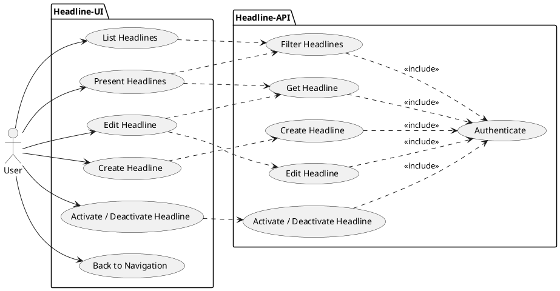
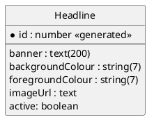

# Headline system Planning

## Requirements

- Create a full stack system, all code should be written using C#
- You must store your code in a free GitHub repo, commit regularly, and email the link when done
- Common Requirements:
  - The client applications:
    - Xamarin.Forms 5 applications
      - Using shared code - .NET Standard 2.0 minimum
      - MVVMLight should be used for IoC – make sure you use the .net standard compatible
        package
      - SQLite should be used to cache data locally
      - The Xamarin.Forms UI’s should be built up using code using C# using the
        Xamarin.CommunityToolkit.Markup nuget package – NOT XAML – for maximum
        performance
      - All code should be written with performance in mind – but while still being readable and
        easily maintainable, and well tested
      - Two target clients should be added for solution: Android and UWP (Windows 10)
  - Blazor Server web application:
    - Must target .net6.0
    - Using shared code - .NET Standard 2.0 minimum
    - MVVMLight should be used for IoC – make sure you use the .net standard compatible
      package
    - MudBlazor, which is free, should be used for the UI controls where possible
      www.mudblazor.com
    - All code should be written with performance in mind – but while still being readable and
      easily maintainable, and well tested
    - You may use CSS and/or Typescript to do the scrolling animation
  - The backend should be an ASP.Net Core 6.0 project:
    - There should be a Controller for each Model / Entity in the system which allows for REST full CRUD
      access
    - Authentication should be implemented in the best way you see fit
    - You can assume that the project will be run on an SSL enabled application server
    - Store the data in an SQLite db \* All parts of the stack should share as much code as possible.
- Challenge C Functionality should be as follows:
  - Your application “Headline” should allow the user to add headlines i.e. company wide messages that the
    company wants to be displayed everywhere they have LCD screens.
  - Upon opening it should have a login page for the user to identify themselves, thereafter they should be
    presented with two buttons:
    - Manage
      - This should allow the user to create and edit one to many “Headlines”
      - When adding/editing a Headline:
        - It should allow plain text of up to 200 characters
        - It should allow choosing of background and foreground/text colour
        - It should allow choosing of an associated image
        - It should have a “Is Active ?” checkbox/switch
        - It should have “Save” and “Cancel” buttons, tapping/clicking “Save” the app should POST (if new) and PUT (if existing) an Headline model to the server backend
    - Present
      - This should display a view that shows the active headlines, by scrolling them horizontally
        across the centre of the screen (e.g. like the headlines on CNN)
      - The background of the view must be according to the BackgroundColour specified on the
        Headline, and the Text Colour according to the TextColour
      - If there is an Image specified it should show it in the top left of the screen, with the text
        scrolling below it (there should be a gap between the two)
      - At the top right there should be a small x button to close the “Present” view and return to
        the main menu

## Design

### Use-case diagram

<div hidden>


### Data Model


</div>


### System Context / Landscape

```plantuml
@startuml
!include https://raw.githubusercontent.com/plantuml-stdlib/C4-PlantUML/master/C4_Component.puml
!define SPRITESURL https://raw.githubusercontent.com/plantuml-stdlib/gilbarbara-plantuml-sprites/v1.0/sprites
!includeurl SPRITESURL/xamarin.puml
!includeurl SPRITESURL/microsoft-windows.puml
!includeurl SPRITESURL/android.puml
!includeurl SPRITESURL/sqlite.puml
!includeurl SPRITESURL/dotnet.puml

sprite blazor <svg viewBox="0 0 24 24">
<path fill="#555555" d="M23.8337 8.1013a13.9123 13.9123 0 0 1-13.6424 11.72 10.1053 10.1053 0 0 1-1.994-.121 6.111 6.111 0 0 1-5.0824-5.7607 5.9344 5.9344 0 0 1 11.867-.0838c.025.9835-.4011 1.8464-1.277 1.8713-.9356 0-1.3742-.6677-1.3742-1.5674v-2.5001a1.5313 1.5313 0 0 0-1.5196-1.5328H8.7152a3.6481 3.6481 0 1 0 2.6948 6.0794l.0733-.1093.0734.1213a2.5807 2.5807 0 0 0 2.2007 1.0479 2.9088 2.9088 0 0 0 2.6947-3.0406 7.912 7.912 0 0 0-.217-1.9324 7.4043 7.4043 0 0 0-14.6395 1.6033 7.4971 7.4971 0 0 0 7.307 7.4043s.549.05 1.1677.0357a15.8029 15.8029 0 0 0 8.4747-2.5283c.036-.025.0719.025.048.0614a12.4392 12.4392 0 0 1-9.6901 3.9625A8.7442 8.7442 0 0 1 .003 13.8603a9.049 9.049 0 0 1 3.6349-7.2471 8.8634 8.8634 0 0 1 5.229-1.7262h2.813a7.9145 7.9145 0 0 0 5.8386-2.5777.1093.1093 0 0 1 .0594-.034.1115.1115 0 0 1 .1195.0522.113.113 0 0 1 .0155.0672 7.9345 7.9345 0 0 1-1.2274 3.5493.1075.1075 0 0 0-.0132.0609.1098.1098 0 0 0 .0724.0945.109.109 0 0 0 .0619.0033 8.5054 8.5054 0 0 0 5.9134-4.876.1554.1554 0 0 1 .0546-.0527.1497.1497 0 0 1 .147 0 .1535.1535 0 0 1 .0546.0527 10.779 10.779 0 0 1 1.0575 6.8746zm-14.9383 3.527a2.188 2.188 0 1 0 2.1877 2.1878v-2.0425a.1577.1577 0 0 0-.1497-.1497Z"/>
</svg>

AddElementTag("ui", $bgColor="cyan")
AddElementTag("lib", $bgColor="silver")
AddElementTag("test", $bgColor="#909090")
AddElementTag("db", $bgColor="#909090")
AddElementTag("api", $bgColor="#909090")

AddRelTag("authRel", $textColor="#c0c0c0", $lineColor="#c0c0c0")

HIDE_STEREOTYPE()
LAYOUT_LEFT_RIGHT()

Person(user, "User")
System_Boundary(headline, "Headline System") {
	'BLAZOR
	Component(blazor, "Blazor Application", "C#, .NET 6.0, MVVMLight, MudBlazor", "Allows for displaying and maintaining headlines.", $sprite="blazor", $tags="ui")

	'XAMARIN
	Component(xam, "Xamarin Application", "Xamarin Forms 5, .NET Standard 2.0, MVVMLight, SQLite, Xamarin.CommunityToolkit.Markup", "Allows for displaying and maintaining headlines.", $sprite="xamarin", $tags="ui")
	Component(xamAndroid, "Xamarin Android", $sprite="android", $tags="ui")
	Component(xamWindows, "Xamarin UWP", $sprite="microsoft-windows", $tags="ui")

	'LIBRARY
	Component(config, "Config", "C#, .NET Standard 2.0", $sprite="dotnet", $tags="lib")
	Component(models, "Models (DTOs)", "C#, .NET Standard 2.0", $sprite="dotnet", $tags="lib")

	'API
	Component(api, "API", "C#, .NET Standard 2.0", $sprite="dotnet", $tags="api")
	ComponentDb(db, "Database", "SQLite", $sprite="sqlite", $tags="db")
	Component(apiTest, "API Tests", "C#, .NET 6.0", $sprite="dotnet", $tags="test")

}
System(auth, "Auth0")

Rel(blazor, config, " ")
Rel(blazor, models, " ")
Rel(blazor, api, "https")

Rel(models, xam, " ")
Rel(config, xam, " ")
Rel(api, xam, "https")

Rel(xam, xamAndroid, " ")
Rel(xam, xamWindows, " ")

Rel_R(api, apiTest, " ")
Rel(api, db, "TCP")

Rel(user, auth, "https", $tags="authRel")
Rel(user, xamAndroid, "https", $tags="authRel")
Rel(user, xamWindows, "https", $tags="authRel")
Rel_L(user, blazor, "https", $tags="authRel")

Rel(auth, xamAndroid, "https", $tags="authRel")
Rel(auth, xamWindows, "https", $tags="authRel")
Rel(auth, blazor, "https", $tags="authRel")
Rel(auth, api, "https", $tags="authRel")

 @enduml
```

## API Authorization

## Nice to have but out of scope

- Paging of headlines when listed for maintenance
- Searching for a headline
- Deleting a headline from the database
- Recording statistics like how many times a headline has been shown
- Headline image sizing and optimizing
- Storing images
- UI Authentication and Authorization

## Decision Log

- Not using `MVVMLight` as it's been [deprecated](https://www.nuget.org/packages/MvvmLight/5.4.1.1?_src=template). Using the recommended CommunityToolkit.Mvvm.

## Dev Notes / Questions

- MVVM architecture is overkill for solution?
- Same solution using .NET MAUI should be quicker and simpler?
